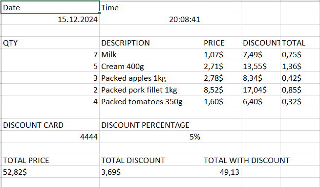

# Shopping check creator
## This application receives shopping list and writes check in .csv file
This README file is relevant for only feature/entry-core branch
## Links
- [Installation and usage](#installation)
- [Result](#result)

## Installation and usage

### Requirements:
- Java 21

1. Clone this repository
```bash
git clone https://github.com/1kotik/Check-creator.git
 ```
2. Run the project
```bash
java -cp src ./src/main/java/org/example/CheckRunner.java discountCard=xxxx balanceDebitCard=xxxx id-quantity id-quantity ...
```
Parameters:
- discountCard: discount card number, 4 digits (e.g. 1234)
- balanceDebitCard: balance in $ (e.g. 123.45)
- id-quantity: id of product and quantity of product respectively (e.g 1-2 2-5 20-1 1-5)

## Result

Result is written in console and result.csv

